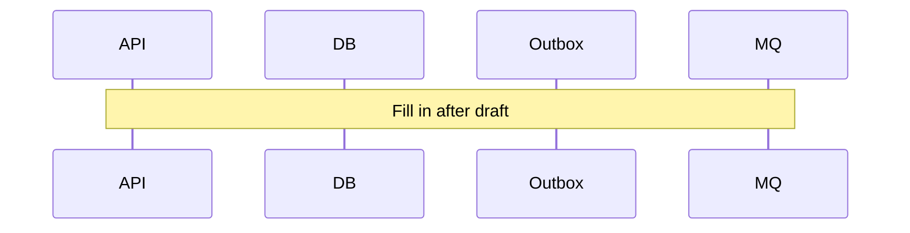

# Task 03 — Money movement lifecycle

**Goal:** Specify flows end-to-end before coding services.

**Prerequisite:** Tasks 01–02.

## Steps

### User transfer (plan §8)

- [ ] Numbered steps from auth → idempotency → lock → ledger → projection → outbox → commit → publish.
- [ ] Identify **single DB transaction** boundary: what is atomic.
- [ ] Specify **row lock** strategy on source account (SELECT … FOR UPDATE).
- [ ] Define **failure points** and user-visible errors vs retries.

### Payroll batch (plan §10)

- [ ] Flow: upload → validate → **single reserve** on employer → child credits → reconciliation.
- [ ] Explicitly rule out “N simultaneous raw debits” for N employees.
- [ ] Per-item failure handling and idempotency key strategy.

### FX conversion (plan §11)

- [ ] Flow: rate fetch → **FxQuote** creation → user confirm → validate quote not expired → ledger with quote snapshot.
- [ ] Reject execution if quote invalid.

### Cross-cutting

- [ ] Where **fraud layer 1** runs (sync, before fund release) vs **layer 2** (async after event) — plan §12.
- [ ] Which **correlation / request IDs** propagate through each flow (plan §16).

## Acceptance criteria

- Each flow has a **sequence diagram** (Mermaid or bullet pseudo-sequence).
- “Money commits in PostgreSQL before async consumers act” is visible in each flow (plan §14).

## Optional diagram slot

